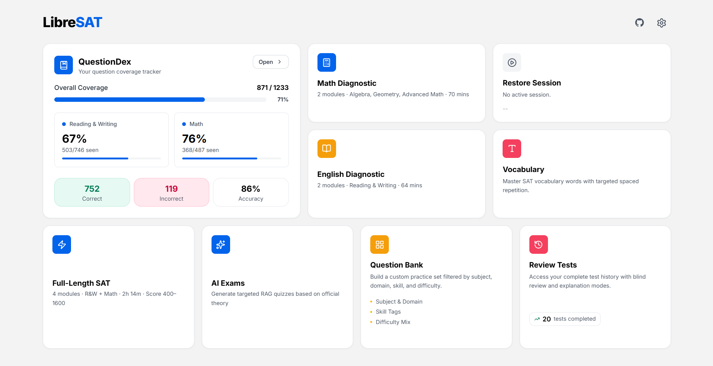

# LibreSAT

A local-first **Digital SAT Practice Exam** web application built with Next.js 16, TypeScript, and Tailwind CSS v4. Powered by a 1,233-question database extracted from College Board Question Bank PDFs.

  
  
  
  
  
  
  
  
  

---

## Features

### 🏠 Dashboard
Responsive bento box layout for quick access to all modules.

### 📋 Exam Suite
- **Full SATs & Diagnostics:** Pre-generated, zero question overlap.
- **🎲 Randomized Exams:** Dynamically sampled on demand.

### ⏱️ Exam Engine
- Strict countdown timer and silent per-question time logging.
- Authentic module difficulty distributions.
- MCQ, numeric grid-in inputs, Desmos Graphing Calculator, and Formula Sheet.
- Question navigator and flag-for-review system.

### 📊 Analytics & Results
- Animated score card simulating official scaled scores (400–1600).
- Visual charts for time spent and domain performance.
- **Quick-Look:** Instant preview of question, answer, and explanation.
- **PDF Export:** Download a beautifully formatted, selectable PDF of your wrong answers to review later or share with your favorite AI tutor.

### 🔄 Review Workspace
- Historical archive of completed sessions.
- Toggle to re-attempt blindly or view correct answers and explanations.

### 📖 QuestionDex
- Tracker for all 1,233 questions, color-coded by seen/unseen.
- Filters and search with live coverage bars.
- Click to launch single-item practice modals.

### 🛠️ Custom Question Bank
- Build targeted practice sets via Section, Domain, Skill, and Difficulty filters.

### 🤖 AI Assistant
- AI-powered dynamic explanations and tutoring to help you understand your mistakes better. Your own API Key is needed to use this feature.

### 💾 Import / Export
- Easily backup, restore, or transfer your complete practice history and QuestionDex progress.

---

## Data Persistence & State Management

All user data is stored entirely in **browser localStorage**—no backend server or database is required, ensuring zero latency and full offline capability.

### Storage Keys
- `sat_sessions` — Logs of completed test sessions, timestamps, and score results.
- `sat_questiondex` — Per-question states (seen, correct, incorrect).
- `sat_in_progress` — Real-time auto-saving of the active exam state.
- `sat_completed_static` — Tracks fully completed static exam IDs.

### Save & Exit Mechanism
- Calculates precise remaining time and takes a snapshot of the exam state when paused.
- Resumes seamlessly from the dashboard at the exact question and second left off.

---

## Tech Stack

| Technology | Version | Purpose |
|---|---|---|
| Next.js | 16 (App Router) | Framework |
| TypeScript | 5.x | Type safety |
| Tailwind CSS | 4.x | Styling |
| KaTeX | 0.18.x | LaTeX math rendering |
| Recharts | 3.x | Analytics charts |
| Lucide React | latest | Icons |
| Desmos | iframe embed | Graphing calculator |