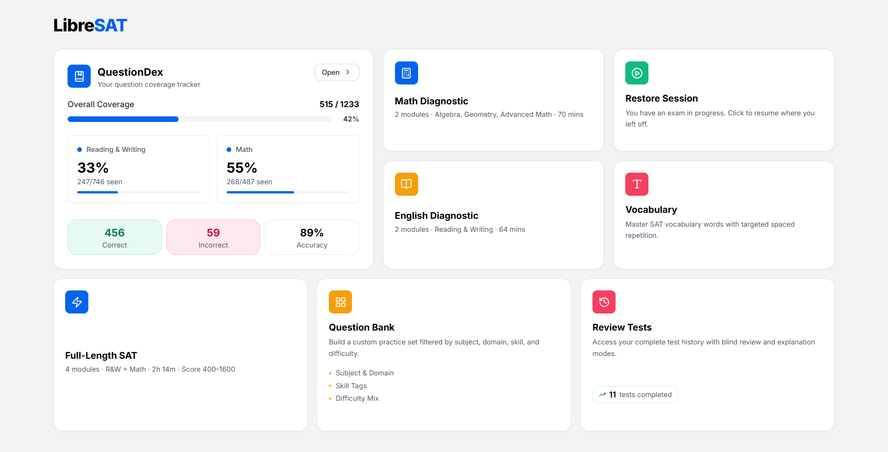

# LibreSAT

[](https://libresat.netlify.app/)

A local-first **Digital SAT Practice Exam** web application built with Next.js 16, TypeScript, and Tailwind CSS v4. Powered by a 1,233-question database extracted from College Board Question Bank PDFs.



---

## Features

### 🏠 Dashboard
Responsive bento box layout for quick access to all modules.

### 📋 Exam Suite
- **Full SATs & Diagnostics:** Pre-generated, zero question overlap.
- **🎲 Randomized Exams:** Dynamically sampled on demand.

### ⏱️ Exam Engine
- Strict countdown timer and silent per-question time logging.
- Authentic module difficulty distributions.
- MCQ, numeric grid-in inputs, Desmos Graphing Calculator, and Formula Sheet.
- Question navigator and flag-for-review system.

### 📊 Analytics & Results
- Animated score card simulating official scaled scores (400–1600).
- Visual charts for time spent and domain performance.
- **Quick-Look:** Instant preview of question, answer, and explanation.

### 🔄 Review Workspace
- Historical archive of completed sessions.
- Toggle to re-attempt blindly or view correct answers and explanations.

### 📖 QuestionDex
- Tracker for all 1,233 questions, color-coded by seen/unseen.
- Filters and search with live coverage bars.
- Click to launch single-item practice modals.

### 🛠️ Custom Question Bank
- Build targeted practice sets via Section, Domain, Skill, and Difficulty filters.

### 🤖 AI Assistant
- AI-powered dynamic explanations and tutoring to help you understand your mistakes better. Your own API Key is needed to use this feature.

### 💾 Import / Export
- Easily backup, restore, or transfer your complete practice history and QuestionDex progress.

---

## Data Persistence & State Management

All user data is stored entirely in **browser localStorage**—no backend server or database is required, ensuring zero latency and full offline capability.

### Storage Keys
- `sat_sessions` — Logs of completed test sessions, timestamps, and score results.
- `sat_questiondex` — Per-question states (seen, correct, incorrect).
- `sat_in_progress` — Real-time auto-saving of the active exam state.
- `sat_completed_static` — Tracks fully completed static exam IDs.

### Save & Exit Mechanism
- Calculates precise remaining time and takes a snapshot of the exam state when paused.
- Resumes seamlessly from the dashboard at the exact question and second left off.

---

## Tech Stack

| Technology | Version | Purpose |
|---|---|---|
| Next.js | 16 (App Router) | Framework |
| TypeScript | 5.x | Type safety |
| Tailwind CSS | 4.x | Styling |
| KaTeX | 0.18.x | LaTeX math rendering |
| Recharts | 3.x | Analytics charts |
| Lucide React | latest | Icons |
| Desmos | iframe embed | Graphing calculator |

---

## Project Structure

```text
sat-platform/
├── public/
│   ├── questions_database.json   ← 1,233-question database (R&W + Math)
│   └── exam_suites.json          ← Pre-generated static exam suites
├── app/
│   ├── page.tsx                  ← Dashboard (Bento Grid)
│   ├── globals.css               ← Design system (dark mode, animations)
│   ├── layout.tsx                ← Root layout + AppProvider
│   ├── context/
│   │   └── AppContext.tsx        ← Global state (questions, QuestionDex, sessions)
│   ├── lib/
│   │   ├── db.ts                 ← Database loader, sampler, randomized exam generator
│   │   ├── storage.ts            ← localStorage abstraction
│   │   └── scoring.ts            ← SAT scaled score lookup tables
│   ├── types/
│   │   └── index.ts              ← All TypeScript interfaces
│   ├── select/[type]/            ← Exam selection screen
│   ├── exam/[sessionId]/         ← Live exam engine
│   ├── results/[sessionId]/      ← Analytics dashboard
│   ├── review/
│   │   ├── page.tsx              ← Test history archive
│   │   └── [sessionId]/          ← Question-by-question review
│   ├── questiondex/              ← QuestionDex catalog
│   └── questionbank/             ← Custom test builder
└── components/
    └── ui/                       ← Button, Modal, Badge, ProgressBar, MathRenderer
```

---

## Question Database Schema

```jsonc
{
  "question_id": "618d94c4",
  "section": "Reading and Writing" | "Math",
  "domain": "Algebra",
  "skill": "Linear equations in one variable",
  "difficulty": "Easy" | "Medium" | "Hard",
  "is_open_ended": false,          // true = numeric grid-in
  "stimulus": "Passage text...",   // may be empty string
  "question_text": "Which of the following...",
  "options": { "A": "...", "B": "...", "C": "...", "D": "..." } | null,
  "correct_answer": "B",           // letter key or numeric string
  "explanation": "Choice B is correct because..."
}
```

Math fields (`question_text`, `options`, `explanation`) use LaTeX notation delimited by `$...$` for inline and `$$...$$` for display math, rendered client-side via KaTeX.
